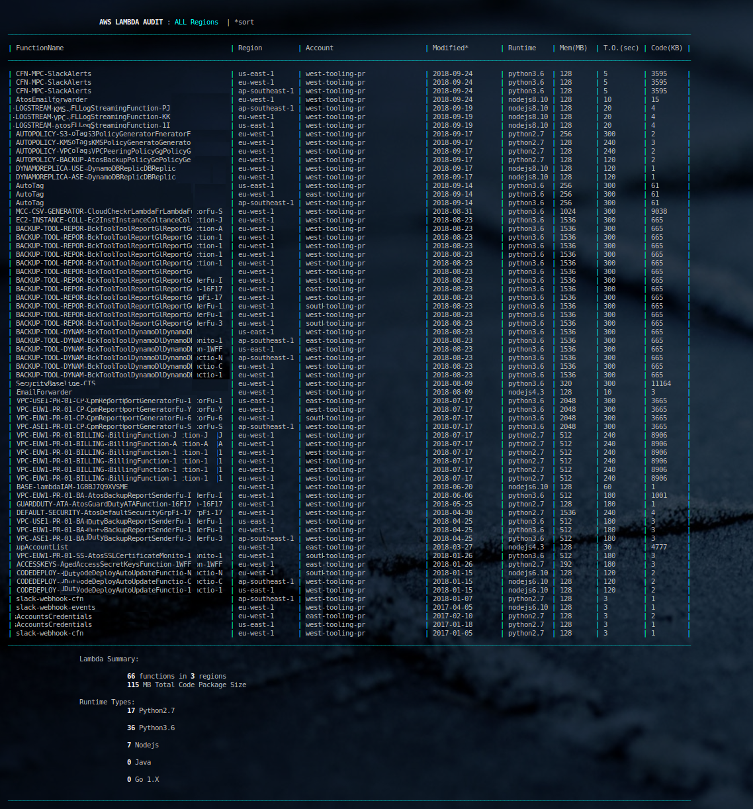

* * *
# lambda-audit
* * *

## Purpose

* Audit all regions of an AWS Account for installed lambda functions
* Audit multiple AWS Accounts
* Return timely metadata describing each function

* * * 

## Screenshots

* * * 

## Author & Copyright

All works contained herein copyrighted via below author unless work is explicitly noted by an alternate author.

* Copyright Blake Huber, All Rights Reserved.

* * *

## License

* Software contained in this repo is licensed under the [license agreement](https://bitbucket.org/blakeca00/library-utilities/src/master/LICENSE.md).

* * *

## Disclaimer

*Code is provided "as is". No liability is assumed by either the code's originating author nor this repo's owner for their use at AWS or any other facility. Furthermore, running function code at AWS may incur monetary charges; in some cases, charges may be substantial. Charges are the sole responsibility of the account holder executing code obtained from this library.*

Additional terms may be found in the complete [license agreement](https://bitbucket.org/blakeca00/library-utilities/src/master/LICENSE.md).

* * *

